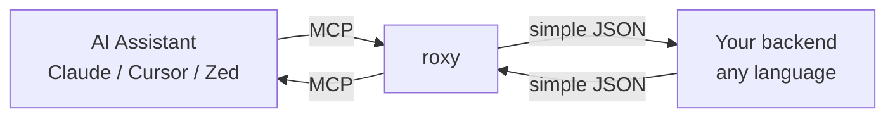

# roxy

---

**English** · [Русский](i18n/README.ru.md) · [Українська](i18n/README.uk.md) · [Беларуская](i18n/README.be.md) · [Polski](i18n/README.pl.md) · [Deutsch](i18n/README.de.md) · [Français](i18n/README.fr.md) · [Español](i18n/README.es.md) · [中文](i18n/README.zh-CN.md) · [日本語](i18n/README.ja.md)

---

**High-performance MCP (Model Context Protocol) proxy server written in Rust.**

roxy bridges MCP clients (Claude Desktop, Cursor, Zed, …) to any backend running as **FastCGI** (e.g. PHP-FPM) or **HTTP(S)** — so you can write MCP servers in **any language** (PHP, Python, Node, Go, Ruby, …) without reimplementing JSON-RPC, transport, session management, or capability negotiation.

> 📘 **New here? Read the [User Guide](docs/USER_GUIDE.md)** — a friendly, illustrated walkthrough with diagrams, the full CLI reference, the complete backend API, and ready-made configuration examples.

---

## At a glance

- **Multi-backend** — FastCGI (TCP or Unix socket) and HTTP(S), auto-detected from the URL.
- **Two transports** — `stdio` (for desktop clients like Claude Desktop) and `http` (for team deployments).
- **MCP 2025-06-18 features** — elicitation, structured output, resource links.
- **Connection pooling** for FastCGI.
- **Static musl builds** — one binary, any Linux distro.
- **Header forwarding** — client headers reach your backend automatically under HTTP transport.

See the [User Guide → What is roxy](docs/USER_GUIDE.md#1-what-is-roxy-in-one-minute) for the plain-English version.

---

## Install

```bash
# Homebrew (macOS & Linux)
brew tap petstack/tap
brew install roxy

# Or, one-line install on any Unix
curl -sSfL https://raw.githubusercontent.com/petstack/roxy/main/install.sh | sh
```

More options (`.deb`, `.rpm`, static tarball, from source): see the [User Guide → Installing roxy](docs/USER_GUIDE.md#4-installing-roxy).

Verify:

```bash
roxy --version
roxy --help
```

---

## Quick start

1. **Start a backend** (any language, any framework). A ready example:

   ```bash
   python3 examples/handler.py        # listens on :8000
   ```

2. **Connect Claude Desktop** by adding to `claude_desktop_config.json`:

   ```json
   {
     "mcpServers": {
       "my-tools": {
         "command": "roxy",
         "args": ["--upstream", "http://127.0.0.1:8000/"]
       }
     }
   }
   ```

   Claude Desktop will spawn `roxy` automatically — you don't need to run it yourself.

For PHP-FPM / FastCGI, remote HTTP, Kubernetes env-var setups — see the [User Guide → Full configuration examples](docs/USER_GUIDE.md#15-full-configuration-examples).

---

## How it works



Your backend never sees MCP — only a small, stable JSON protocol. Full walkthrough with sequence diagrams: [User Guide → How roxy works](docs/USER_GUIDE.md#3-how-roxy-works-the-big-picture).

---

## CLI at a glance

```
roxy [OPTIONS] --upstream <UPSTREAM>
```

| Flag | Default | Purpose |
|---|---|---|
| `--upstream <URL>` | **required** | Backend URL (auto-detects HTTP / FastCGI) |
| `--transport <MODE>` | `stdio` | `stdio` or `http` |
| `--port <PORT>` | `8080` | Listen port (with `--transport http`) |
| `--upstream-entrypoint <PATH>` | — | `SCRIPT_FILENAME` for FastCGI backends |
| `--upstream-timeout <SECS>` | `30` | Upstream request timeout |
| `--upstream-insecure` | `false` | Skip TLS verification |
| `--upstream-header "Name: Value"` | — | Static header for HTTP upstreams (repeatable) |
| `--pool-size <N>` | `16` | FastCGI connection pool size |
| `--log-format <FORMAT>` | `pretty` | `pretty` or `json` |

Every flag has a matching `ROXY_*` environment variable. Full reference with examples and env-var rules: [User Guide → CLI flags reference](docs/USER_GUIDE.md#8-cli-flags-reference) and [Environment variables](docs/USER_GUIDE.md#9-environment-variables).

---

## Writing a backend

Your handler receives a small JSON envelope and returns a JSON response. It never sees JSON-RPC or MCP framing.

Working examples in the [`examples/`](examples/) folder:

- [`handler.py`](examples/handler.py) — Python (HTTP, stdlib only)
- [`handler.ts`](examples/handler.ts) — TypeScript / Node.js (HTTP)
- [`handler.php`](examples/handler.php) — PHP (FastCGI / PHP-FPM)

Full protocol reference — every request type, every field, tables and diagrams: [User Guide → The backend API](docs/USER_GUIDE.md#10-the-backend-api-detailed).

---

## Learn more

- 📘 **[User Guide](docs/USER_GUIDE.md)** — the main, friendly documentation
- 🔀 [Header forwarding rules](docs/USER_GUIDE.md#11-header-forwarding)
- 📜 [Logging & `RUST_LOG`](docs/USER_GUIDE.md#12-logging-and-observability)
- 🛟 [Error messages — what they mean](docs/USER_GUIDE.md#13-error-messages--what-they-mean)
- ❓ [FAQ](docs/USER_GUIDE.md#16-frequently-asked-questions)
- 📈 [Benchmarks](docs/BENCHMARKS.md)

---

## Development

roxy itself is a Rust project (edition 2024). Standard workflow:

```bash
cargo build           # debug
cargo build --release # optimized
cargo test
cargo clippy
cargo fmt
```

Architecture map, source layout, and contributor notes: see [`CONTRIBUTING.md`](CONTRIBUTING.md) and [`CLAUDE.md`](CLAUDE.md).

Release process — tagged pushes trigger GitHub Actions that build binaries for macOS (arm64/x86_64) and Linux (arm64/x86_64, musl-static), publish `.deb` / `.rpm` packages, and bump the Homebrew formula.

---

## License

[Apache-2.0](LICENSE).
