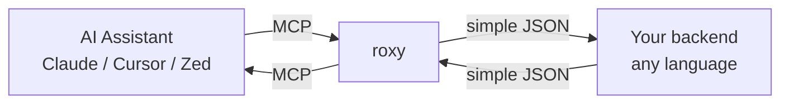

# roxy

---

**English** · [Русский](i18n/README.ru.md) · [Українська](i18n/README.uk.md) · [Беларуская](i18n/README.be.md) · [Polski](i18n/README.pl.md) · [Deutsch](i18n/README.de.md) · [Français](i18n/README.fr.md) · [Español](i18n/README.es.md) · [中文](i18n/README.zh-CN.md) · [日本語](i18n/README.ja.md)

---

**The MCP gateway for backends in any language.**

roxy is a high-performance gateway, written in Rust, that connects any existing
backend — in any programming language — to the **Model Context Protocol (MCP)**.
roxy speaks MCP so your code doesn't have to: you expose your logic as a plain
"JSON in, JSON out" handler (PHP, Python, Node, Go, Ruby — anything reachable
over **HTTP(S)** or **FastCGI**), and roxy handles the transport, sessions,
capability negotiation, structured output, and elicitation.

> 📘 **New here? Read the [User Guide](docs/en/index.md)** — a friendly, illustrated walkthrough with diagrams, the full backend API, and ready-made configuration examples.

---

## Why roxy

Writing an MCP server natively means reimplementing a lot of protocol plumbing —
in every language, often with no mature SDK to lean on:

- **JSON-RPC 2.0** framing, request/response correlation, and error formatting
- **Two transports** — `stdio` for desktop clients and HTTP + SSE for teams
- **Session management** and **capability negotiation** (the MCP handshake)
- The newer **2025-06-18** features: **elicitation** (multi-step "ask the user"
  flows), **structured output**, and **resource links**

roxy moves all of that into a single Rust binary. Your backend never sees
JSON-RPC or MCP framing — only a small, stable JSON contract. That means you can:

- **Use any language** — if it can read JSON and write JSON, it can be an MCP server.
- **Reuse what you already have** — point roxy at an existing PHP-FPM (FastCGI)
  app or any HTTP endpoint; no rewrite required.
- **Get the hard parts for free** — pooling, both transports, header forwarding,
  and the full elicitation loop are handled for you.

---

## How it works


```mermaid
flowchart LR
    A[AI Assistant<br/>Claude / Cursor / Zed] -- MCP --> R[roxy]
    R -- simple JSON --> B[Your backend<br/>any language]
    B -- simple JSON --> R
    R -- MCP --> A
```

An MCP client connects to roxy over `stdio` or HTTP. For every request, roxy
translates the MCP call into a small JSON **envelope** and sends it to your
backend over HTTP(S) or FastCGI. Your backend inspects `type`, does the work, and
returns JSON; roxy turns that back into a proper MCP response.

The envelope is one of five request types — `discover`, `call_tool`,
`read_resource`, `get_prompt`, `elicitation_cancelled`:

```jsonc
// roxy → your backend
{ "type": "call_tool", "name": "echo", "arguments": { "message": "hi" },
  "session_id": "…", "request_id": "…" }

// your backend → roxy
{ "content": [ { "type": "text", "text": "hi" } ] }
```

Capabilities are discovered **per request** — roxy calls `discover` on every
`tools/list` (and the resource/prompt equivalents), so your tool catalog can
change at runtime without restarting anything. Full walkthrough with sequence
diagrams: [User Guide → How roxy works](docs/en/introduction.md#how-roxy-works-the-big-picture).

---

## Install

```bash
# Homebrew (macOS & Linux)
brew tap petstack/tap
brew install roxy

# Or, one-line install on any Unix
curl -sSfL https://raw.githubusercontent.com/petstack/roxy/main/install.sh | sh
```

```powershell
# Windows (amd64 / arm64) — Scoop
scoop bucket add petstack https://github.com/petstack/scoop-bucket
scoop install roxy
```

Windows users can also grab the portable `roxy.exe` or the `.zip` directly from the [Releases](https://github.com/petstack/roxy/releases) page. On Windows, FastCGI upstreams must use a TCP address (`host:port`); Unix-socket upstreams are Unix-only — use HTTP or TCP FastCGI.

More options (`.deb`, `.rpm`, static tarball, from source): see the [User Guide → Installing roxy](docs/en/installation.md#installing-roxy).

Verify:

```bash
roxy --version
roxy --help
```

---

## Quick start

1. **Start a backend** (any language, any framework). A ready example:

   ```bash
   python3 examples/handler.py        # listens on :8000
   ```

2. **Connect Claude Desktop** by adding to `claude_desktop_config.json`:

   ```json
   {
     "mcpServers": {
       "my-tools": {
         "command": "roxy",
         "args": ["--upstream", "http://127.0.0.1:8000/"]
       }
     }
   }
   ```

   Claude Desktop will spawn `roxy` automatically — you don't need to run it yourself.

---

## Usage & configuration

```
roxy [OPTIONS] --upstream <UPSTREAM>
```

### Transports

roxy exposes MCP to clients over one of two transports, set with `--transport`:

- **`stdio`** (default) — for desktop clients like Claude Desktop, which spawn
  `roxy` as a subprocess and talk to it over stdin/stdout.
- **`http`** — an HTTP + SSE server on `--port` (default `8080`, path `/mcp`) for
  shared/team deployments where multiple clients connect over the network.

### MCP protocol revisions

roxy is a gateway, so it serves **every** MCP revision a client may speak.
Clients upgrade on their own schedule; roxy absorbs the difference so your
backend never has to know which era the caller comes from. One process answers
all of them on the same endpoint:

| Revisions | Lifecycle | Result shape |
|---|---|---|
| `2024-11-05`, `2025-03-26`, `2025-06-18`, `2025-11-25` | `initialize` handshake, plus `Mcp-Session-Id` and the standalone `GET` SSE stream where the revision defines them | no `resultType` |
| `2026-07-28` | no handshake — every request carries its own `_meta` (protocol version, client capabilities, client info) and no session id | `resultType` on every result; `Mcp-Method` / `Mcp-Name` request headers are required and validated against the body (`-32020` on mismatch) |

The revision is chosen **per request**, not per deployment: a `2025-11-25`
client and a `2026-07-28` client can share one roxy process and each receives
result shapes valid for its own revision. A client that wants to know what roxy
speaks before committing can ask with `server/discover`.

Not yet implemented for `2026-07-28`: multi round-trip elicitation (MRTR) and
cache hints (`ttlMs` / `cacheScope`) on list results. Elicitation still uses the
server-initiated flow, so multi-step "ask the user" tools require a client on
`2025-06-18` … `2025-11-25`; everything else works on every revision.

### Choosing a backend

The `--upstream` value is **auto-detected** — you don't pick the executor type:

| `--upstream` format | Backend |
|---|---|
| `http://…` / `https://…` | HTTP(S) |
| `host:port` | FastCGI over TCP (e.g. PHP-FPM) |
| `/path/to/socket` | FastCGI over a Unix socket (Unix only) |

FastCGI upstreams also need `--upstream-entrypoint` (the `SCRIPT_FILENAME`, e.g.
the path to your `handler.php`).

### CLI flags

| Flag | Default | Purpose |
|---|---|---|
| `--upstream <URL>` | **required** | Backend URL (auto-detects HTTP / FastCGI) |
| `--transport <MODE>` | `stdio` | `stdio` or `http` |
| `--port <PORT>` | `8080` | Listen port (with `--transport http`) |
| `--upstream-entrypoint <PATH>` | — | `SCRIPT_FILENAME` for FastCGI backends |
| `--upstream-timeout <SECS>` | `30` | Upstream request timeout |
| `--upstream-insecure` | `false` | Skip TLS verification (HTTPS upstreams) |
| `--upstream-header "Name: Value"` | — | Static header for HTTP upstreams (repeatable) |
| `--pool-size <N>` | `16` | FastCGI connection pool size |
| `--log-format <FORMAT>` | `pretty` | `pretty` or `json` |

### Environment variables

Every flag has a matching `ROXY_*` environment variable. Precedence is
**CLI > env > default**.

| Flag | Env |
|---|---|
| `--transport` | `ROXY_TRANSPORT` |
| `--port` | `ROXY_PORT` |
| `--upstream` | `ROXY_UPSTREAM` |
| `--upstream-entrypoint` | `ROXY_UPSTREAM_ENTRYPOINT` |
| `--upstream-insecure` | `ROXY_UPSTREAM_INSECURE` (only `true` / `false`) |
| `--upstream-timeout` | `ROXY_UPSTREAM_TIMEOUT` |
| `--upstream-header` | `ROXY_UPSTREAM_HEADER` (newline-separated; the CLI flag overrides env entirely) |
| `--pool-size` | `ROXY_POOL_SIZE` |
| `--log-format` | `ROXY_LOG_FORMAT` |

Log verbosity is controlled separately by `RUST_LOG` (e.g. `RUST_LOG=debug`).

### Header forwarding

Under `--transport http`, every incoming client header is forwarded to your
backend automatically. Hop-by-hop headers (RFC 7230 §6.1), roxy-managed headers
(`Host`, `Content-Type`, `Content-Length`), and `Proxy` (httpoxy / CVE-2016-5385)
are dropped; everything else — `Authorization`, `Cookie`, `X-*`, `mcp-session-id`
— passes through. HTTP upstreams receive real HTTP headers; FastCGI upstreams
receive them as CGI `HTTP_*` parameters. Nothing is forwarded under `stdio`. Full
rules: [User Guide → Header forwarding](docs/en/operations.md#header-forwarding).

### Configuration examples

**Claude Desktop + PHP-FPM (FastCGI, stdio)** — in `claude_desktop_config.json`:

```json
{
  "mcpServers": {
    "my-tools": {
      "command": "roxy",
      "args": [
        "--upstream", "127.0.0.1:9000",
        "--upstream-entrypoint", "/srv/app/handler.php"
      ]
    }
  }
}
```

**Team server over HTTP, talking to a remote HTTPS backend with auth:**

```bash
roxy --transport http --port 8080 \
     --upstream https://api.example.com/mcp \
     --upstream-header "Authorization: Bearer $TOKEN" \
     --upstream-timeout 60
```

**Container / Kubernetes-style, configured entirely via environment:**

```bash
export ROXY_TRANSPORT=http
export ROXY_PORT=8080
export ROXY_UPSTREAM=https://api.example.com/mcp
roxy
```

More end-to-end recipes: [User Guide → Full configuration examples](docs/en/examples-and-faq.md#full-configuration-examples).

---

## Build a backend

Your handler receives the JSON envelope shown in [How it works](#how-it-works)
and returns JSON — it never sees JSON-RPC or MCP framing. A reply is one of
`content`, `error`, or `elicit`. Runnable examples live in [`examples/`](examples/):
[`handler.py`](examples/handler.py) (Python),
[`handler.ts`](examples/handler.ts) (Node/TypeScript), and
[`handler.php`](examples/handler.php) (PHP / FastCGI).

The complete protocol reference — every request type and field, with tables and
diagrams — is in the [User Guide → The backend API](docs/en/backend-api.md).

---

## Learn more

- 📘 **[User Guide](docs/en/index.md)** — the main, friendly documentation
- 🧩 [The backend API](docs/en/backend-api.md)
- 🔀 [Header forwarding rules](docs/en/operations.md#header-forwarding)
- 📜 [Logging & `RUST_LOG`](docs/en/operations.md#logging-and-observability)
- 🛟 [Error messages — what they mean](docs/en/operations.md#error-messages--what-they-mean)
- ❓ [FAQ](docs/en/examples-and-faq.md#frequently-asked-questions)
- 📈 [Benchmarks](docs/BENCHMARKS.md)

---

## Contributing & development

roxy itself is a Rust project (edition 2024). Build, test, and local-development
instructions, the architecture map, and the release process are in
[`CONTRIBUTING.md`](CONTRIBUTING.md).

---

## License

[Apache-2.0](LICENSE).

---

<p align="center"><sub><i>Built and evolved with AI under careful human guidance.</i></sub></p>