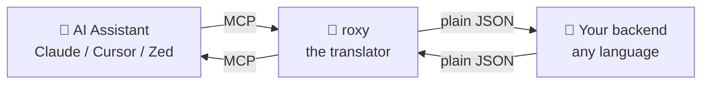
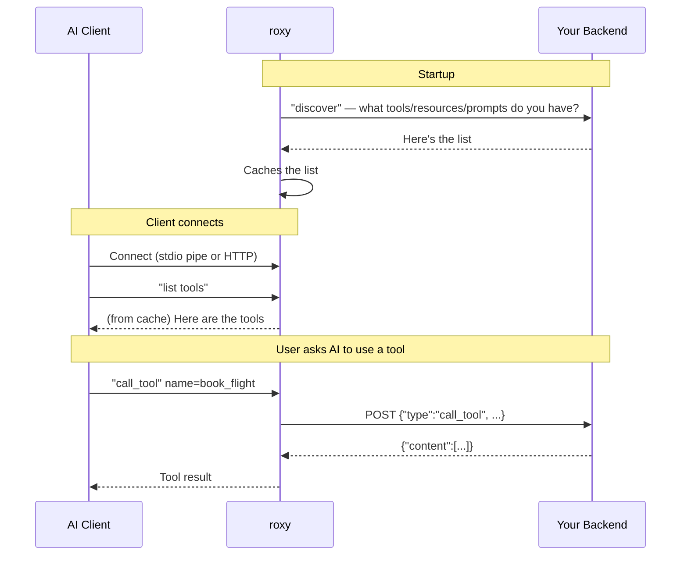
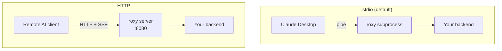
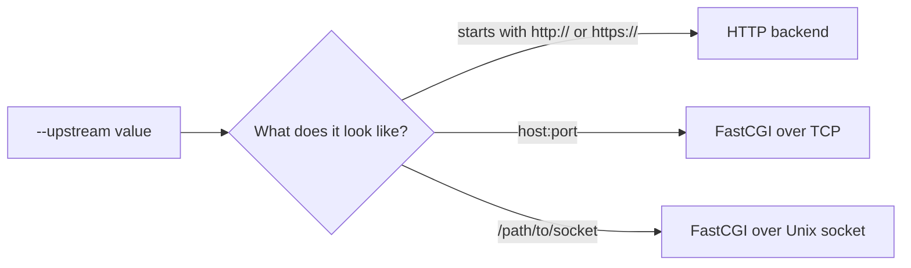
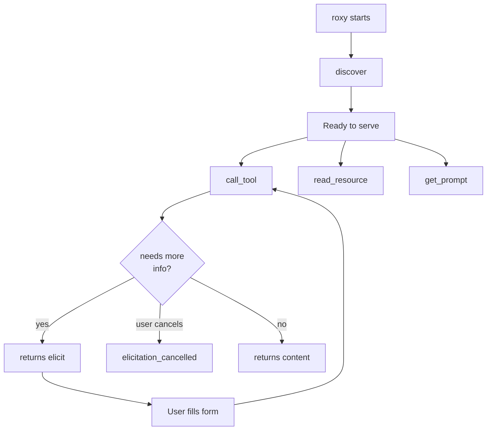
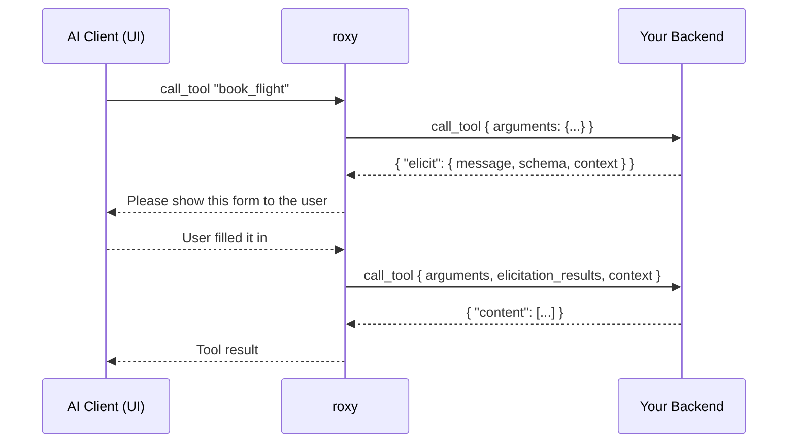
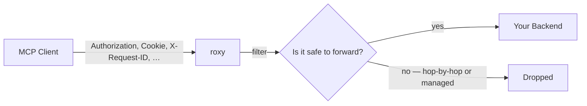

# roxy — User Guide

A friendly, illustrated guide for people who want to use **roxy** — no insider knowledge required.

---

## Table of contents

1. [What is roxy, in one minute](#1-what-is-roxy-in-one-minute)
2. [A tiny bit of vocabulary](#2-a-tiny-bit-of-vocabulary)
3. [How roxy works (the big picture)](#3-how-roxy-works-the-big-picture)
4. [Installing roxy](#4-installing-roxy)
5. [Your first run in 2 steps](#5-your-first-run-in-2-steps)
6. [Transport modes — stdio vs HTTP](#6-transport-modes--stdio-vs-http)
7. [Connecting to your backend](#7-connecting-to-your-backend)
8. [CLI flags reference](#8-cli-flags-reference)
9. [Environment variables](#9-environment-variables)
10. [The backend API (detailed)](#10-the-backend-api-detailed)
11. [Header forwarding](#11-header-forwarding)
12. [Logging and observability](#12-logging-and-observability)
13. [Error messages — what they mean](#13-error-messages--what-they-mean)
14. [Example backends](#14-example-backends)
15. [Full configuration examples](#15-full-configuration-examples)
16. [Frequently asked questions](#16-frequently-asked-questions)

---

## 1. What is roxy, in one minute

Imagine you run a candy shop. People walk up to a little window, say what they want, and you hand it over. Simple.

Now imagine AI assistants like Claude, Cursor, or Zed want to talk to **your** shop — your calendar, your database, your weather service, your booking system — anything. But they only know one very specific way to ask questions: a protocol called **MCP** (Model Context Protocol). If you don't speak MCP, they can't hear you.

**roxy is a translator standing at the window.**

- On one side: the AI assistant, speaking MCP.
- On the other side: your shop (your server), speaking plain JSON over HTTP or FastCGI.
- In the middle: roxy, passing messages back and forth and handling all the fiddly parts of MCP for you.

You write your logic in any language you like — PHP, Python, Node, Go, Ruby, even a shell script. roxy handles the rest.



---

## 2. A tiny bit of vocabulary

You'll see these words a lot. Here they are in one place, in plain English:

| Word | What it means |
|---|---|
| **MCP** | Model Context Protocol. The special language AI assistants use to ask for tools, data, and prompts. Think of it as the "USB-C for AI apps." |
| **MCP client** | The AI app that wants to use your tools — Claude Desktop, Cursor, Zed, and so on. |
| **MCP server** | The thing the client talks to. In our case, **roxy** is the MCP server. |
| **Backend** (a.k.a. "upstream") | **Your** server that actually does the work. roxy forwards every request to your backend. |
| **Tool** | A function the AI can call — "book a flight", "send email", "query database". |
| **Resource** | A piece of data the AI can read — a document, a profile, a log file. |
| **Prompt** | A ready-made instruction template the AI can fill in. |
| **Transport** | How the MCP client talks to roxy. Either **stdio** (through a pipe) or **HTTP** (over the network). |
| **FastCGI** | A classic way web servers talk to apps (used by PHP-FPM and similar). roxy speaks it natively. |

---

## 3. How roxy works (the big picture)

Here's everything that happens from the moment roxy starts up to the moment an AI assistant calls one of your tools:



Key idea: **your backend never sees MCP.** It only sees a simple, stable JSON protocol that roxy defines. If MCP ever changes, roxy adapts — you don't have to.

---

## 4. Installing roxy

Pick whichever method matches your setup. All methods install the same `roxy` binary.

### Homebrew (macOS or Linux)

```
brew tap petstack/tap
brew install roxy
```

### One-line install script (any Unix-like system)

```
curl -sSfL https://raw.githubusercontent.com/petstack/roxy/main/install.sh | sh
```

You can pin a specific version or change the install directory:

```
curl -sSfL https://raw.githubusercontent.com/petstack/roxy/main/install.sh | sh -s -- --version v0.1.0 --bin-dir $HOME/.local/bin
```

### Debian / Ubuntu

```
curl -sSfLO https://github.com/petstack/roxy/releases/latest/download/roxy_0.1.0-1_amd64.deb
sudo dpkg -i roxy_0.1.0-1_amd64.deb
```

### Fedora / RHEL / openSUSE

```
sudo rpm -i https://github.com/petstack/roxy/releases/latest/download/roxy-0.1.0-1.x86_64.rpm
```

### Static tarball (Alpine or any Linux)

```
curl -sSfL https://github.com/petstack/roxy/releases/latest/download/roxy-v0.1.0-x86_64-unknown-linux-musl.tar.gz | tar -xz
sudo install -m 755 roxy-v0.1.0-x86_64-unknown-linux-musl/roxy /usr/local/bin/
```

### Check it worked

```
roxy --version
roxy --help
```

---

## 5. Your first run in 2 steps

The shortest path from zero to a working roxy.

**Step 1 — Pick a backend.** For a quick try, use one of the bundled examples:

```
python3 examples/handler.py
```

This starts a small HTTP server on `http://127.0.0.1:8000/`.

**Step 2 — Connect your AI client.** For Claude Desktop, edit `~/.config/Claude/claude_desktop_config.json` (or its equivalent on your OS) and add:

```json
{
  "mcpServers": {
    "my-tools": {
      "command": "roxy",
      "args": ["--upstream", "http://127.0.0.1:8000/"]
    }
  }
}
```

Restart Claude Desktop. Your tools will appear in the MCP panel. Done.

Claude Desktop spawns `roxy` for you as a subprocess — you don't need to run it in a terminal yourself. If you want to run roxy as a long-lived network server instead (for remote clients or a team deployment), see [Transport modes](#6-transport-modes--stdio-vs-http) below.

---

## 6. Transport modes — stdio vs HTTP

roxy offers two ways for the AI client to reach it. Pick the one that fits your situation.



### stdio (default)

The AI client **starts roxy as a child process** and communicates through standard input/output. Nothing is exposed on the network. This is what you want for a desktop AI app like Claude Desktop or Cursor.

- Started by: the MCP client itself, via the `command` field in its config.
- Exposes: nothing.
- Good for: local desktop use.

### HTTP

roxy runs as a standalone server and listens on a port (default `:8080`). Clients connect over HTTP with Server-Sent Events (SSE) for streaming. This lets remote users or multiple clients share one roxy instance.

- Started by: you, manually or from systemd/docker/k8s.
- Endpoint: `http://<host>:<port>/mcp`
- Good for: team deployments, containerized setups, remote access.

```
roxy --transport http --port 8080 --upstream http://your-backend/
```

---

## 7. Connecting to your backend

roxy figures out what kind of backend you have by looking at the `--upstream` value.



| Example `--upstream` | Detected as |
|---|---|
| `http://localhost:8000/mcp` | HTTP |
| `https://api.example.com/mcp` | HTTPS |
| `127.0.0.1:9000` | FastCGI, TCP |
| `/var/run/php-fpm.sock` | FastCGI, Unix socket |

For **FastCGI** backends you also need to tell roxy *which script* to run, via `--upstream-entrypoint`:

```
roxy --upstream 127.0.0.1:9000 --upstream-entrypoint /srv/app/handler.php
```

For **HTTP** backends you can add headers, timeouts, and skip TLS verification if needed (see the next section).

---

## 8. CLI flags reference

Every flag has a matching environment variable. Precedence: **CLI > environment > default**.

| Flag | Env variable | Default | What it does |
|---|---|---|---|
| `--upstream <URL>` | `ROXY_UPSTREAM` | — (**required**) | Where your backend lives. Auto-detects HTTP / FastCGI-TCP / FastCGI-Unix. |
| `--transport <mode>` | `ROXY_TRANSPORT` | `stdio` | How the AI client reaches roxy. Values: `stdio`, `http`. |
| `--port <N>` | `ROXY_PORT` | `8080` | TCP port to listen on, when transport is `http`. |
| `--upstream-entrypoint <path>` | `ROXY_UPSTREAM_ENTRYPOINT` | — | For FastCGI only. The absolute path of the handler file (sent as `SCRIPT_FILENAME`). |
| `--upstream-timeout <secs>` | `ROXY_UPSTREAM_TIMEOUT` | `30` | How long roxy waits for your backend before giving up. |
| `--upstream-insecure` | `ROXY_UPSTREAM_INSECURE` | `false` | Skip TLS certificate verification. Only use in development. Env accepts only literal `true` or `false`. |
| `--upstream-header "Name: Value"` | `ROXY_UPSTREAM_HEADER` | — | Add a static header to every upstream HTTP request. Repeatable on CLI. Ignored for FastCGI. |
| `--pool-size <N>` | `ROXY_POOL_SIZE` | `16` | Number of reusable connections to a FastCGI backend. |
| `--log-format <fmt>` | `ROXY_LOG_FORMAT` | `pretty` | `pretty` for humans, `json` for log aggregators. |

Ask roxy to describe itself anytime:

```
roxy --help
roxy --version
```

---

## 9. Environment variables

Every flag above can be set via its `ROXY_*` equivalent. A few notes:

- **`ROXY_UPSTREAM_INSECURE`** accepts only the exact strings `true` or `false`. `TRUE`, `1`, `yes` will be rejected. This is deliberate — it prevents accidental security holes from typos.
- **`ROXY_UPSTREAM_HEADER`** is newline-separated for multiple headers. It works naturally with Kubernetes YAML:
  ```yaml
  env:
    - name: ROXY_UPSTREAM_HEADER
      value: |-
        Authorization: Bearer abcdef
        X-Tenant: acme
  ```
  From a shell:
  ```
  ROXY_UPSTREAM_HEADER=$'Authorization: Bearer abcdef\nX-Tenant: acme' roxy --upstream ...
  ```
  If you pass `--upstream-header` on the command line *at all*, the environment value is ignored entirely — no merging.
- **`RUST_LOG`** controls log verbosity (see [Logging](#12-logging-and-observability)). It's not a `ROXY_*` variable because it's handled by the standard Rust logging stack.

---

## 10. The backend API (detailed)

This is the **contract** your backend must fulfill. It's plain JSON over HTTP or FastCGI. Your backend never sees MCP — only these simple messages.

### How a request looks

Every request roxy sends is a JSON object with a shared envelope plus request-specific fields:

```json
{
  "type": "call_tool",
  "session_id": "b7a0… or null",
  "request_id": "unique per request",
  "...": "type-specific fields here"
}
```

| Envelope field | Type | Meaning |
|---|---|---|
| `type` | string | Which kind of request this is. See below. |
| `session_id` | string or null | A stable ID for the conversation. Echo it back when useful. |
| `request_id` | string | Unique per request. Useful for logging and tracing. |

### Request types at a glance



| `type` | Sent when | Purpose |
|---|---|---|
| `discover` | Once, at roxy startup | Ask the backend to list all tools, resources, and prompts. |
| `call_tool` | Whenever the AI invokes a tool | Run a tool and return a result. |
| `read_resource` | Whenever the AI reads a resource | Fetch a resource by URI. |
| `get_prompt` | Whenever the AI renders a prompt | Fill a prompt template with arguments. |
| `elicitation_cancelled` | After a user declines an elicitation | Let the backend clean up any pending state. |

---

### 10.1 `discover`

Sent once when roxy starts. The response is cached and served to every MCP client without re-asking your backend.

**Request**

```json
{
  "type": "discover",
  "session_id": null,
  "request_id": "req-001"
}
```

**Response**

```json
{
  "tools": [
    {
      "name": "book_flight",
      "title": "Book a flight",
      "description": "Reserve a seat on a flight.",
      "input_schema": {
        "type": "object",
        "properties": {
          "destination": { "type": "string" },
          "date": { "type": "string", "format": "date" }
        },
        "required": ["destination", "date"]
      },
      "output_schema": {
        "type": "object",
        "properties": {
          "confirmation_code": { "type": "string" }
        }
      }
    }
  ],
  "resources": [
    {
      "uri": "myapp://users/42",
      "name": "user-42",
      "title": "User #42",
      "description": "Profile for user 42.",
      "mime_type": "application/json"
    }
  ],
  "prompts": [
    {
      "name": "greet",
      "title": "Friendly greeting",
      "description": "Greet a person by name.",
      "arguments": [
        { "name": "who", "title": "Name", "required": true }
      ]
    }
  ]
}
```

**Field reference**

Tool:

| Field | Required | Type | Description |
|---|---|---|---|
| `name` | yes | string | Unique tool ID. Used in `call_tool`. |
| `title` | no | string | Pretty name for humans. |
| `description` | no | string | Short explanation shown to the AI. |
| `input_schema` | yes | object (JSON Schema) | Shape of the arguments the AI should provide. |
| `output_schema` | no | object (JSON Schema) | Shape of the structured output the tool returns (optional). |

Resource:

| Field | Required | Type | Description |
|---|---|---|---|
| `uri` | yes | string | Unique URI for this resource. Used in `read_resource`. |
| `name` | yes | string | Short machine name. |
| `title` | no | string | Pretty name for humans. |
| `description` | no | string | Short explanation. |
| `mime_type` | no | string | e.g. `application/json`, `text/plain`. |

Prompt:

| Field | Required | Type | Description |
|---|---|---|---|
| `name` | yes | string | Unique prompt ID. Used in `get_prompt`. |
| `title` | no | string | Pretty name. |
| `description` | no | string | Short explanation. |
| `arguments` | no | array | List of argument definitions (see below). |

Prompt argument:

| Field | Required | Type | Description |
|---|---|---|---|
| `name` | yes | string | Argument name. |
| `title` | no | string | Pretty name. |
| `description` | no | string | Short explanation. |
| `required` | no | boolean | Defaults to `false`. |

---

### 10.2 `call_tool`

Sent whenever the AI invokes one of your tools.

**Request**

```json
{
  "type": "call_tool",
  "name": "book_flight",
  "arguments": {
    "destination": "Tokyo",
    "date": "2026-05-01"
  },
  "session_id": "abc123",
  "request_id": "req-42",
  "elicitation_results": [],
  "context": null
}
```

| Field | Required | Meaning |
|---|---|---|
| `name` | yes | The tool being called. |
| `arguments` | no | Whatever the AI passed in. Shape follows the tool's `input_schema`. |
| `elicitation_results` | no | Present on follow-up calls after an elicitation round (see below). |
| `context` | no | Anything the backend passed back in a previous `elicit` — echoed unchanged. |

**Success response — plain text**

```json
{
  "content": [
    { "type": "text", "text": "Booked seat 14A on flight NH101." }
  ]
}
```

**Success response — with structured output**

```json
{
  "content": [
    { "type": "text", "text": "Booked: confirmation AB12CD." }
  ],
  "structured_content": {
    "confirmation_code": "AB12CD",
    "seat": "14A"
  }
}
```

**Success response — with a resource link**

```json
{
  "content": [
    { "type": "text", "text": "Booking created." },
    {
      "type": "resource_link",
      "uri": "myapp://bookings/1234",
      "name": "booking-1234",
      "title": "Booking #1234",
      "description": "Your confirmed booking",
      "mime_type": "application/json"
    }
  ]
}
```

**Error response** (any request type can use this)

```json
{
  "error": {
    "code": 404,
    "message": "Unknown flight number."
  }
}
```

**Elicitation — ask the user for more information**

Instead of returning `content` or `error`, return `elicit`:

```json
{
  "elicit": {
    "message": "Which class would you like?",
    "schema": {
      "type": "object",
      "properties": {
        "class": {
          "type": "string",
          "enum": ["economy", "business", "first"]
        }
      },
      "required": ["class"]
    },
    "context": { "step": 1, "destination": "Tokyo" }
  }
}
```

What happens next:



You can elicit as many rounds as you need — each new `call_tool` carries the previous `context` back so you know where you left off.

---

### 10.3 `read_resource`

Sent when the AI wants to read one of your resources.

**Request**

```json
{
  "type": "read_resource",
  "uri": "myapp://users/42",
  "session_id": "abc123",
  "request_id": "req-7"
}
```

**Response** — same `content` format as `call_tool`, or an `error`.

```json
{
  "content": [
    { "type": "text", "text": "{\"id\":42,\"name\":\"Alice\"}" }
  ]
}
```

---

### 10.4 `get_prompt`

Sent when the AI wants to render a prompt template.

**Request**

```json
{
  "type": "get_prompt",
  "name": "greet",
  "arguments": { "who": "Alice" },
  "session_id": "abc123",
  "request_id": "req-8"
}
```

**Response** — same `content` format as `call_tool`, or an `error`.

```json
{
  "content": [
    { "type": "text", "text": "Hello, Alice! Nice to meet you." }
  ]
}
```

---

### 10.5 `elicitation_cancelled`

Sent when a user declines or cancels an elicitation form you asked for. Use it to clean up pending state. roxy does not care what you return.

**Request**

```json
{
  "type": "elicitation_cancelled",
  "name": "book_flight",
  "action": "decline",
  "context": { "step": 1, "destination": "Tokyo" },
  "session_id": "abc123",
  "request_id": "req-9"
}
```

| Field | Meaning |
|---|---|
| `action` | Either `"decline"` (user said no) or `"cancel"` (user closed the form). |
| `context` | Whatever you put in your previous `elicit` response. |

---

### 10.6 Content blocks — shared format

Anything that returns `content` uses the same shape: an array of blocks.

| Block `type` | Fields | Used for |
|---|---|---|
| `text` | `text` (string) | Any textual output. |
| `resource_link` | `uri`, `name`, optional `title`, `description`, `mime_type` | Point to a resource the AI can later read. |

You can mix text and resource links in one response.

---

## 11. Header forwarding

When roxy runs in **HTTP transport** mode, every header the MCP client sends is automatically forwarded to your backend. This is how authorization, session IDs, and tracing headers reach your app without you configuring anything.



### Headers that are **dropped**

- Hop-by-hop headers (RFC 7230): `Connection`, `Keep-Alive`, `Proxy-Authenticate`, `Proxy-Authorization`, `TE`, `Trailer`, `Transfer-Encoding`, `Upgrade`.
- Roxy-managed headers: `Host`, `Content-Type`, `Content-Length`.
- The dangerous `Proxy` header (CVE-2016-5385 / "httpoxy").

### Headers that are **forwarded**

Everything else: `Authorization`, `Cookie`, `mcp-session-id`, `X-Forwarded-For`, any custom `X-*`, and so on.

### How it reaches your backend

**HTTP backends** receive them as real HTTP request headers. Multiple values of the same header (e.g. two `X-Forwarded-For`) are preserved.

**FastCGI backends** receive them as CGI parameters named `HTTP_*`, following RFC 3875. Example:

| Incoming header | FastCGI parameter |
|---|---|
| `Authorization: Bearer xyz` | `HTTP_AUTHORIZATION=Bearer xyz` |
| `X-Forwarded-For: 1.1.1.1` | `HTTP_X_FORWARDED_FOR=1.1.1.1` |

If a header has multiple values, roxy joins them with `, ` — this matches how nginx's `$http_*` variables expose them. CGI has no native multi-value support.

### Interaction with `--upstream-header`

`--upstream-header` sets roxy's **own** identity headers on HTTP upstreams (e.g. a bearer token that represents roxy itself). When a client-forwarded header has the same name, the **client value wins** — it's more specific.

`--upstream-header` currently does nothing for FastCGI backends. Use auto-forwarding instead.

### Under `--transport stdio`

There's no incoming HTTP request at all, so nothing is forwarded. Static `--upstream-header` still applies to HTTP upstreams.

---

## 12. Logging and observability

roxy writes structured logs to standard error.

### Verbosity

Controlled with the standard `RUST_LOG` environment variable.

| `RUST_LOG` value | What you see |
|---|---|
| *(unset)* or `info` | Startup banner, transport + upstream info, one line per tool/resource/prompt call. |
| `debug` | Everything above, plus request/response bodies and header-forwarding details. |
| `trace` | Very verbose. Not recommended for production. |
| `roxy=debug,rmcp=info` | Per-module filtering. |

### Format

| `--log-format` | Output |
|---|---|
| `pretty` (default) | Human-friendly, colored if stderr is a terminal. |
| `json` | One JSON object per line. Works with Datadog, ELK, Loki, etc. |

### What normal startup looks like

```
INFO roxy: roxy starting
INFO roxy: transport: Stdio
INFO roxy: upstream: http://localhost:8000/mcp
INFO roxy: using HTTP executor → http://localhost:8000/mcp
INFO roxy: discovered 3 tools, 1 resource, 1 prompt
```

### What a tool call looks like

```
INFO roxy: call_tool: book_flight
```

With `RUST_LOG=debug` you also see the request URL, forwarded headers, and response payload.

---

## 13. Error messages — what they mean

A quick guide to the most common problems.

| You see… | It means… | Try… |
|---|---|---|
| `error: the following required arguments were not provided: --upstream` | You forgot the `--upstream` flag. | Add `--upstream <your-backend-url>`. |
| `upstream error: connection refused` | Your backend isn't listening on the address you gave. | Check it's running. Check the host/port. |
| `upstream error: request timeout` | Your backend didn't answer within `--upstream-timeout` seconds. | Increase `--upstream-timeout` or investigate the backend. |
| `upstream returned HTTP 500` | Your backend returned an error status. | Look at your backend's logs. |
| `failed to parse upstream response` | Your backend returned something that isn't valid JSON, or missing required fields. | Log what you're returning and compare against this guide. |
| `failed to parse upstream discover response` | Your `discover` reply is malformed — roxy can't start. | Check every tool has `name` and `input_schema`; every resource has `uri` and `name`. |
| `failed to connect to FastCGI socket: No such file or directory` | The Unix socket path doesn't exist. | Check PHP-FPM is running and the socket path is correct. |
| `upstream response has no 'elicit', 'error', or 'content' field` | Your handler returned an empty or unknown-shape response. | Return one of `content`, `error`, or `elicit`. |
| `invalid header format: expected 'Name: Value'` | One of your `--upstream-header` entries is malformed. | Fix the syntax — colon plus space between name and value. |
| `invalid value 'TRUE' for '--upstream-insecure'` | Env variable only accepts lowercase `true` / `false`. | Use `true` or `false`. |
| TLS handshake error | The upstream's HTTPS certificate isn't trusted. | Install the CA, or (dev only) add `--upstream-insecure`. |

Errors that happen mid-request are also returned to the MCP client as standard JSON-RPC errors, so the AI can report them to the user.

---

## 14. Example backends

Complete, runnable examples live in the `examples/` folder. They all implement the same feature set so you can compare languages side by side.

| File | Language | How to run it |
|---|---|---|
| `handler.py` | Python 3, standard library only | `python3 examples/handler.py` — listens on `:8000`. |
| `handler.ts` | TypeScript / Node.js | `npx tsx examples/handler.ts` — listens on `:8000`. |
| `handler.php` | PHP (via PHP-FPM) | Start `php-fpm` on `:9000`, then point roxy at it with `--upstream-entrypoint examples/handler.php`. |
| `echo_upstream.rs` | Rust | A minimal echo backend used for benchmarking roxy itself. |

Each example demonstrates tools, resources, prompts, elicitation, structured output, and resource links.

---

## 15. Full configuration examples

### Claude Desktop + a Python backend

Terminal 1:

```
python3 examples/handler.py
```

Terminal 2 — no roxy needed in a terminal because Claude Desktop starts it for you. Just edit `claude_desktop_config.json`:

```json
{
  "mcpServers": {
    "my-tools": {
      "command": "roxy",
      "args": ["--upstream", "http://127.0.0.1:8000/"]
    }
  }
}
```

### Claude Desktop + PHP-FPM

Terminal 1 — start PHP-FPM:

```
php-fpm --nodaemonize -d "listen=127.0.0.1:9000" -d "pm=static" -d "pm.max_children=4"
```

Claude Desktop config:

```json
{
  "mcpServers": {
    "php-tools": {
      "command": "roxy",
      "args": [
        "--upstream", "127.0.0.1:9000",
        "--upstream-entrypoint", "/absolute/path/to/handler.php"
      ]
    }
  }
}
```

### Team server, remote access over HTTPS

Run roxy as a long-lived network server behind your own reverse proxy / TLS terminator:

```
roxy --transport http --port 8080 \
     --upstream https://internal-api.example.com/mcp \
     --upstream-header "Authorization: Bearer $SERVICE_TOKEN" \
     --upstream-header "X-Tenant: acme" \
     --upstream-timeout 60 \
     --log-format json
```

Clients connect to `https://roxy.yourcompany.com/mcp`.

### Kubernetes-style configuration via environment

```
ROXY_TRANSPORT=http \
ROXY_PORT=8080 \
ROXY_UPSTREAM=https://api.example.com/mcp \
ROXY_UPSTREAM_HEADER=$'Authorization: Bearer xyz\nX-Tenant: acme' \
ROXY_UPSTREAM_TIMEOUT=60 \
ROXY_LOG_FORMAT=json \
RUST_LOG=info \
roxy
```

---

## 16. Frequently asked questions

**Do I need to know Rust to use roxy?**
No. roxy is written in Rust, but you only ever write your backend, in any language you like.

**Does my backend need to speak MCP?**
No. Your backend speaks the simple JSON protocol described in [section 10](#10-the-backend-api-detailed). roxy handles MCP for you.

**Can roxy serve multiple clients at the same time?**
Yes. Under `--transport http` many clients can connect in parallel.

**Can I put roxy behind nginx or a load balancer?**
Yes. Run roxy with `--transport http` and front it with whatever TLS / load-balancing solution you use. Forwarded headers will reach your backend.

**Is data persisted anywhere?**
No. roxy is a stateless translator. Sessions, storage, and state all live in your backend.

**What happens if my backend restarts?**
Existing in-flight requests will fail with a connection error and be reported to the client. New requests succeed as soon as the backend is back up. roxy's capability cache (from the initial `discover`) is kept — restart roxy if you add or remove tools.

**What if I change tools at runtime?**
Restart roxy so it re-runs `discover`. The cache is not invalidated automatically.

**Why are some headers missing from my backend?**
They were probably hop-by-hop headers or internally managed by roxy. See [section 11](#11-header-forwarding).

**Can I use HTTPS between roxy and my backend?**
Yes — just use an `https://` URL in `--upstream`. For development against a self-signed cert, add `--upstream-insecure`.

**Can I run roxy in Docker?**
Yes. The static Linux tarball works in any minimal container. Expose the port if using `--transport http`.

---

Happy routing. If anything here is unclear, that's a documentation bug — please let the roxy team know.
