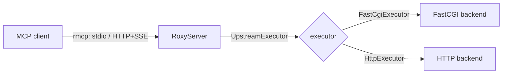

# Architecture

roxy is a small Rust project (edition 2024). It handles everything
performance-critical — the `stdio` and Streamable HTTP transports, protocol
parsing, FastCGI connection pooling, TLS via rustls, and header forwarding —
through the official `rmcp` crate. Your backend only ever deals with the small
JSON contract described in [The backend API](backend-api.md).

An MCP client talks to `RoxyServer` over a transport; `RoxyServer` translates
each call into the internal JSON protocol and forwards it to the configured
`UpstreamExecutor`, which speaks either FastCGI or HTTP to your backend.

## Source map

| File | Responsibility |
|---|---|
| [`src/main.rs`](https://github.com/petstack/roxy/blob/main/src/main.rs) | Entry point — parses the CLI, selects the executor, starts the stdio or HTTP transport. |
| [`src/config.rs`](https://github.com/petstack/roxy/blob/main/src/config.rs) | CLI configuration via `clap`; `UpstreamKind` auto-detection from the `--upstream` URL. |
| [`src/server.rs`](https://github.com/petstack/roxy/blob/main/src/server.rs) | `RoxyServer<E>` — implements `rmcp::ServerHandler`, discovers upstream capabilities per request, forwards MCP calls to the configured executor, and filters hop-by-hop headers for forwarding. |
| [`src/protocol.rs`](https://github.com/petstack/roxy/blob/main/src/protocol.rs) | The internal JSON protocol — `UpstreamRequest`, `UpstreamCallResult`, `UpstreamDiscoverResponse`, `UpstreamEnvelope`. |
| [`src/executor/mod.rs`](https://github.com/petstack/roxy/blob/main/src/executor/mod.rs) | The `UpstreamExecutor` trait with `execute()` and `discover()`, plus the per-request `ExecuteContext`. |
| [`src/executor/fastcgi.rs`](https://github.com/petstack/roxy/blob/main/src/executor/fastcgi.rs) | `FastCgiExecutor` — TCP or Unix socket, `deadpool` connection pooling, CGI `HTTP_*` parameter mapping. |
| [`src/executor/http.rs`](https://github.com/petstack/roxy/blob/main/src/executor/http.rs) | `HttpExecutor` — `reqwest` + rustls, custom headers, configurable timeouts, optional TLS-verification skip. |

## Example backends

Runnable reference handlers live in [`examples/`](https://github.com/petstack/roxy/tree/main/examples):
[`handler.py`](https://github.com/petstack/roxy/blob/main/examples/handler.py) (Python, HTTP),
[`handler.ts`](https://github.com/petstack/roxy/blob/main/examples/handler.ts) (TypeScript/Node, HTTP), and
[`handler.php`](https://github.com/petstack/roxy/blob/main/examples/handler.php) (PHP via FastCGI).
[`echo_upstream.rs`](https://github.com/petstack/roxy/blob/main/examples/echo_upstream.rs) and
[`bench_client.rs`](https://github.com/petstack/roxy/blob/main/examples/bench_client.rs) back the test
and benchmark suites. See [Examples & FAQ](examples-and-faq.md) for how to run them.

## Key dependencies

Declared in [`Cargo.toml`](https://github.com/petstack/roxy/blob/main/Cargo.toml):

- `rmcp` — the official MCP SDK (transport, protocol, `ServerHandler`).
- `fastcgi-client` + `deadpool` — FastCGI client and connection pooling.
- `reqwest` (rustls) — the HTTP(S) upstream client.
- `tokio` — async runtime; `axum` — the HTTP server used by rmcp for the SSE transport.

## Building and contributing

Build, test, lint, and local-development instructions, plus the release process,
are in [`CONTRIBUTING.md`](https://github.com/petstack/roxy/blob/main/CONTRIBUTING.md).
Packaging (Homebrew, Scoop, `.deb`, `.rpm`, static tarball) lives under
[`packaging/`](https://github.com/petstack/roxy/tree/main/packaging), and the
prebuilt-binary installer is [`install.sh`](https://github.com/petstack/roxy/blob/main/install.sh).
Translated overviews are under [`i18n/`](https://github.com/petstack/roxy/tree/main/i18n)
(ru, uk, be, pl, de, fr, es, zh-CN, ja).
