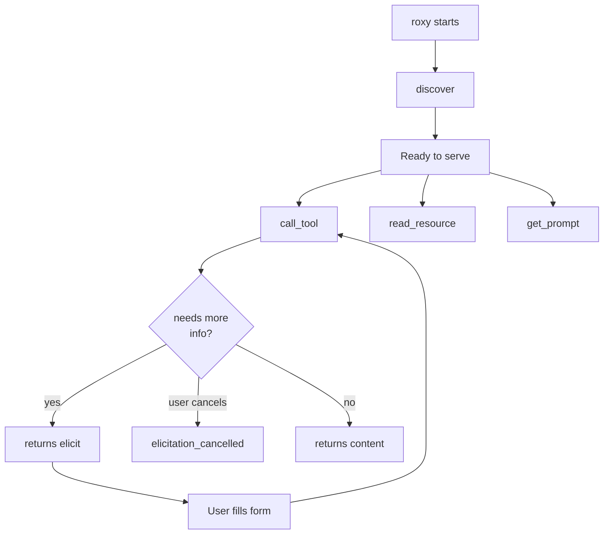
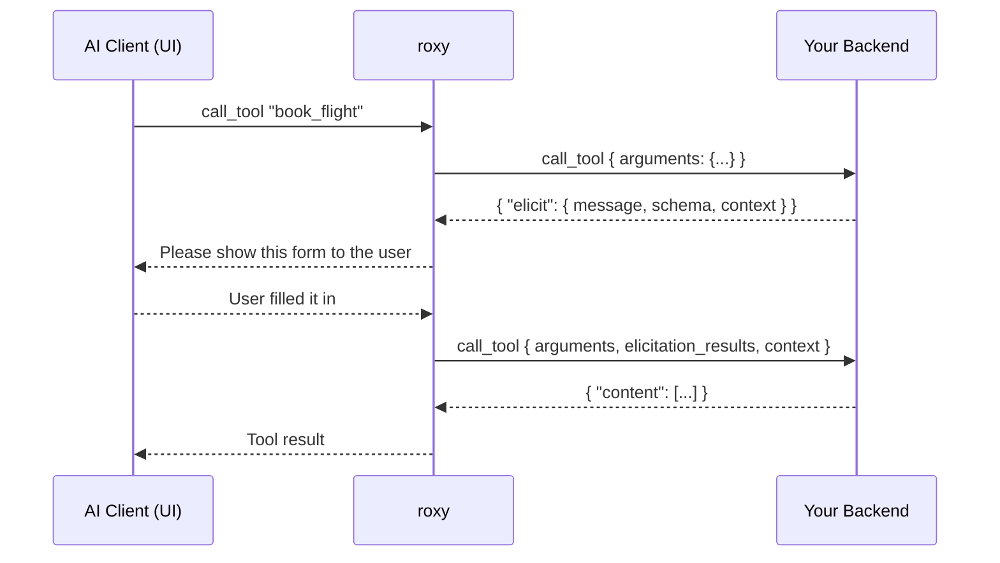

# The backend API

This is the **contract** your backend must fulfill. It's plain JSON over HTTP or FastCGI. Your backend never sees MCP — only these simple messages.

## How a request looks

Every request roxy sends is a JSON object with a shared envelope plus request-specific fields:

```json
{
  "type": "call_tool",
  "session_id": "b7a0… or null",
  "request_id": "unique per request",
  "...": "type-specific fields here"
}
```

| Envelope field | Type | Meaning |
|---|---|---|
| `type` | string | Which kind of request this is. See below. |
| `session_id` | string or null | A stable ID for the conversation. Echo it back when useful. |
| `request_id` | string | Unique per request. Useful for logging and tracing. |

## Request types at a glance



| `type` | Sent when | Purpose |
|---|---|---|
| `discover` | Once, at roxy startup | Ask the backend to list all tools, resources, and prompts. |
| `call_tool` | Whenever the AI invokes a tool | Run a tool and return a result. |
| `read_resource` | Whenever the AI reads a resource | Fetch a resource by URI. |
| `get_prompt` | Whenever the AI renders a prompt | Fill a prompt template with arguments. |
| `elicitation_cancelled` | After a user declines an elicitation | Let the backend clean up any pending state. |

---

## `discover`

Sent whenever an MCP client asks roxy to list tools, resources, or prompts. roxy does not cache the response — each `list_*` call from the client triggers a fresh `discover`, so changes you make to your backend's catalogue show up on the next listing without restarting roxy.

**Order does not matter.** Return your tools, resources and prompts in whatever order is convenient — a directory scan, an unordered registry, a `SELECT` with no `ORDER BY`. roxy sorts them before they reach the client: tools and prompts by `name`, resources by `uri`. That matters because the tool list ends up in the model's prompt, and a list that shuffles between calls invalidates the client's prompt cache every time. You do not need to sort, and sorting differently on your side has no effect.

**Request**

```json
{
  "type": "discover",
  "session_id": null,
  "request_id": "req-001"
}
```

**Response**

```json
{
  "tools": [
    {
      "name": "book_flight",
      "title": "Book a flight",
      "description": "Reserve a seat on a flight.",
      "input_schema": {
        "type": "object",
        "properties": {
          "destination": { "type": "string" },
          "date": { "type": "string", "format": "date" }
        },
        "required": ["destination", "date"]
      },
      "output_schema": {
        "type": "object",
        "properties": {
          "confirmation_code": { "type": "string" }
        }
      }
    }
  ],
  "resources": [
    {
      "uri": "myapp://users/42",
      "name": "user-42",
      "title": "User #42",
      "description": "Profile for user 42.",
      "mime_type": "application/json"
    }
  ],
  "prompts": [
    {
      "name": "greet",
      "title": "Friendly greeting",
      "description": "Greet a person by name.",
      "arguments": [
        { "name": "who", "title": "Name", "required": true }
      ]
    }
  ]
}
```

**Field reference**

Tool:

| Field | Required | Type | Description |
|---|---|---|---|
| `name` | yes | string | Unique tool ID. Used in `call_tool`. |
| `title` | no | string | Pretty name for humans. |
| `description` | no | string | Short explanation shown to the AI. |
| `input_schema` | yes | object (JSON Schema) | Shape of the arguments the AI should provide. |
| `output_schema` | no | object (JSON Schema) | Shape of the structured output the tool returns (optional). |

Resource:

| Field | Required | Type | Description |
|---|---|---|---|
| `uri` | yes | string | Unique URI for this resource. Used in `read_resource`. |
| `name` | yes | string | Short machine name. |
| `title` | no | string | Pretty name for humans. |
| `description` | no | string | Short explanation. |
| `mime_type` | no | string | e.g. `application/json`, `text/plain`. |

Prompt:

| Field | Required | Type | Description |
|---|---|---|---|
| `name` | yes | string | Unique prompt ID. Used in `get_prompt`. |
| `title` | no | string | Pretty name. |
| `description` | no | string | Short explanation. |
| `arguments` | no | array | List of argument definitions (see below). |

Prompt argument:

| Field | Required | Type | Description |
|---|---|---|---|
| `name` | yes | string | Argument name. |
| `title` | no | string | Pretty name. |
| `description` | no | string | Short explanation. |
| `required` | no | boolean | Defaults to `false`. |

---

## `call_tool`

Sent whenever the AI invokes one of your tools.

**Request**

```json
{
  "type": "call_tool",
  "name": "book_flight",
  "arguments": {
    "destination": "Tokyo",
    "date": "2026-05-01"
  },
  "session_id": "abc123",
  "request_id": "req-42",
  "elicitation_results": [],
  "context": null
}
```

| Field | Required | Meaning |
|---|---|---|
| `name` | yes | The tool being called. |
| `arguments` | no | Whatever the AI passed in. Shape follows the tool's `input_schema`. |
| `elicitation_results` | no | Present on follow-up calls after an elicitation round (see below). |
| `context` | no | Anything the backend passed back in a previous `elicit` — echoed unchanged. |

**Success response — plain text**

```json
{
  "content": [
    { "type": "text", "text": "Booked seat 14A on flight NH101." }
  ]
}
```

**Success response — with structured output**

```json
{
  "content": [
    { "type": "text", "text": "Booked: confirmation AB12CD." }
  ],
  "structured_content": {
    "confirmation_code": "AB12CD",
    "seat": "14A"
  }
}
```

**Success response — with a resource link**

```json
{
  "content": [
    { "type": "text", "text": "Booking created." },
    {
      "type": "resource_link",
      "uri": "myapp://bookings/1234",
      "name": "booking-1234",
      "title": "Booking #1234",
      "description": "Your confirmed booking",
      "mime_type": "application/json"
    }
  ]
}
```

**Error response** (any request type can use this)

```json
{
  "error": {
    "code": 404,
    "message": "Unknown flight number."
  }
}
```

**Elicitation — ask the user for more information**

Instead of returning `content` or `error`, return `elicit`:

```json
{
  "elicit": {
    "message": "Which class would you like?",
    "schema": {
      "type": "object",
      "properties": {
        "class": {
          "type": "string",
          "enum": ["economy", "business", "first"]
        }
      },
      "required": ["class"]
    },
    "context": { "step": 1, "destination": "Tokyo" }
  }
}
```

What happens next:



You can elicit as many rounds as you need — each new `call_tool` carries the previous `context` back so you know where you left off.

---

## `read_resource`

Sent when the AI wants to read one of your resources.

**Request**

```json
{
  "type": "read_resource",
  "uri": "myapp://users/42",
  "session_id": "abc123",
  "request_id": "req-7"
}
```

**Response** — same `content` format as `call_tool`, or an `error`.

```json
{
  "content": [
    { "type": "text", "text": "{\"id\":42,\"name\":\"Alice\"}" }
  ]
}
```

---

## `get_prompt`

Sent when the AI wants to render a prompt template.

**Request**

```json
{
  "type": "get_prompt",
  "name": "greet",
  "arguments": { "who": "Alice" },
  "session_id": "abc123",
  "request_id": "req-8"
}
```

**Response** — same `content` format as `call_tool`, or an `error`.

```json
{
  "content": [
    { "type": "text", "text": "Hello, Alice! Nice to meet you." }
  ]
}
```

---

## `elicitation_cancelled`

Sent when a user declines or cancels an elicitation form you asked for. Use it to clean up pending state. roxy does not care what you return.

**Request**

```json
{
  "type": "elicitation_cancelled",
  "name": "book_flight",
  "action": "decline",
  "context": { "step": 1, "destination": "Tokyo" },
  "session_id": "abc123",
  "request_id": "req-9"
}
```

| Field | Meaning |
|---|---|
| `action` | Either `"decline"` (user said no) or `"cancel"` (user closed the form). |
| `context` | Whatever you put in your previous `elicit` response. |

---

## Content blocks — shared format

Anything that returns `content` uses the same shape: an array of blocks.

| Block `type` | Fields | Used for |
|---|---|---|
| `text` | `text` (string) | Any textual output. |
| `resource_link` | `uri`, `name`, optional `title`, `description`, `mime_type` | Point to a resource the AI can later read. |

You can mix text and resource links in one response.
