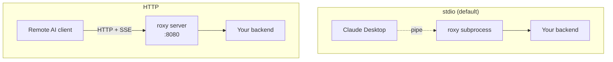
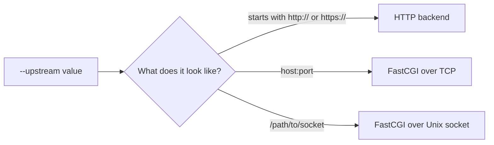

# Configuration

## Transport modes — stdio vs HTTP

roxy offers two ways for the AI client to reach it. Pick the one that fits your situation.



### stdio (default)

The AI client **starts roxy as a child process** and communicates through standard input/output. Nothing is exposed on the network. This is what you want for a desktop AI app like Claude Desktop or Cursor.

- Started by: the MCP client itself, via the `command` field in its config.
- Exposes: nothing.
- Good for: local desktop use.

### HTTP

roxy runs as a standalone server and listens on a port (default `:8080`). Clients connect over HTTP with Server-Sent Events (SSE) for streaming. This lets remote users or multiple clients share one roxy instance.

- Started by: you, manually or from systemd/docker/k8s.
- Endpoint: `http://<host>:<port>/mcp`
- Good for: team deployments, containerized setups, remote access.

```
roxy --transport http --port 8080 --upstream http://your-backend/
```

---

## Connecting to your backend

roxy figures out what kind of backend you have by looking at the `--upstream` value.



| Example `--upstream` | Detected as |
|---|---|
| `http://localhost:8000/mcp` | HTTP |
| `https://api.example.com/mcp` | HTTPS |
| `127.0.0.1:9000` | FastCGI, TCP |
| `/var/run/php-fpm.sock` | FastCGI, Unix socket |

For **FastCGI** backends you also need to tell roxy *which script* to run, via `--upstream-entrypoint`:

```
roxy --upstream 127.0.0.1:9000 --upstream-entrypoint /srv/app/handler.php
```

For **HTTP** backends you can add headers, timeouts, and skip TLS verification if needed (see the flags below).

---

## CLI flags reference

Every flag has a matching environment variable. Precedence: **CLI > environment > default**.

| Flag | Env variable | Default | What it does |
|---|---|---|---|
| `--upstream <URL>` | `ROXY_UPSTREAM` | — (**required**) | Where your backend lives. Auto-detects HTTP / FastCGI-TCP / FastCGI-Unix. |
| `--transport <mode>` | `ROXY_TRANSPORT` | `stdio` | How the AI client reaches roxy. Values: `stdio`, `http`. |
| `--port <N>` | `ROXY_PORT` | `8080` | TCP port to listen on, when transport is `http`. |
| `--upstream-entrypoint <path>` | `ROXY_UPSTREAM_ENTRYPOINT` | — | For FastCGI only. The absolute path of the handler file (sent as `SCRIPT_FILENAME`). |
| `--upstream-timeout <secs>` | `ROXY_UPSTREAM_TIMEOUT` | `30` | How long roxy waits for your backend before giving up. |
| `--upstream-insecure` | `ROXY_UPSTREAM_INSECURE` | `false` | Skip TLS certificate verification. Only use in development. Env accepts only literal `true` or `false`. |
| `--upstream-header "Name: Value"` | `ROXY_UPSTREAM_HEADER` | — | Add a static header to every upstream HTTP request. Repeatable on CLI. Ignored for FastCGI. |
| `--pool-size <N>` | `ROXY_POOL_SIZE` | `16` | Number of reusable connections to a FastCGI backend. |
| `--log-format <fmt>` | `ROXY_LOG_FORMAT` | `pretty` | `pretty` for humans, `json` for log aggregators. |

Ask roxy to describe itself anytime:

```
roxy --help
roxy --version
```

---

## Environment variables

Every flag above can be set via its `ROXY_*` equivalent. A few notes:

- **`ROXY_UPSTREAM_INSECURE`** accepts only the exact strings `true` or `false`. `TRUE`, `1`, `yes` will be rejected. This is deliberate — it prevents accidental security holes from typos.
- **`ROXY_UPSTREAM_HEADER`** is newline-separated for multiple headers. It works naturally with Kubernetes YAML:
  ```yaml
  env:
    - name: ROXY_UPSTREAM_HEADER
      value: |-
        Authorization: Bearer abcdef
        X-Tenant: acme
  ```
  From a shell:
  ```
  ROXY_UPSTREAM_HEADER=$'Authorization: Bearer abcdef\nX-Tenant: acme' roxy --upstream ...
  ```
  If you pass `--upstream-header` on the command line *at all*, the environment value is ignored entirely — no merging.
- **`RUST_LOG`** controls log verbosity (see [Logging](operations.md#logging-and-observability)). It's not a `ROXY_*` variable because it's handled by the standard Rust logging stack.
