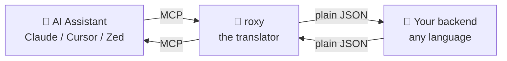
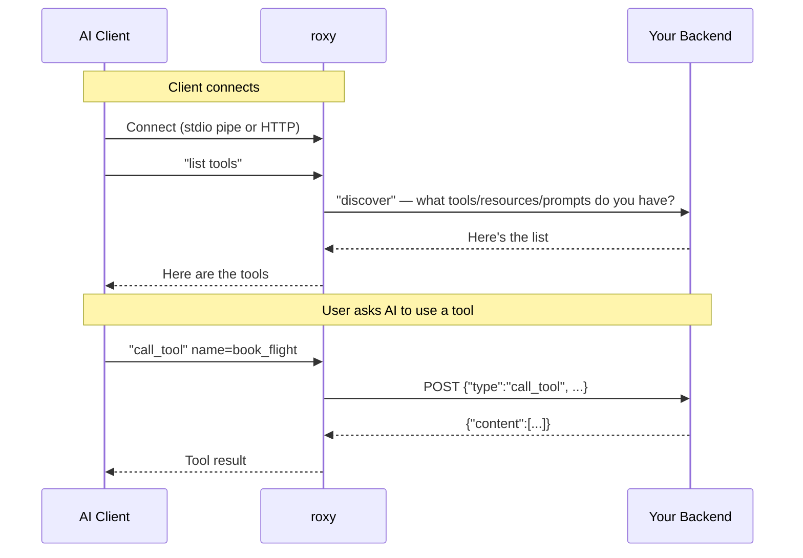

# Introduction

## What is roxy, in one minute

Imagine you run a candy shop. People walk up to a little window, say what they want, and you hand it over. Simple.

Now imagine AI assistants like Claude, Cursor, or Zed want to talk to **your** shop — your calendar, your database, your weather service, your booking system — anything. But they only know one very specific way to ask questions: a protocol called **MCP** (Model Context Protocol). If you don't speak MCP, they can't hear you.

**roxy is a translator standing at the window.**

- On one side: the AI assistant, speaking MCP.
- On the other side: your shop (your server), speaking plain JSON over HTTP or FastCGI.
- In the middle: roxy, passing messages back and forth and handling all the fiddly parts of MCP for you.

You write your logic in any language you like — PHP, Python, Node, Go, Ruby, even a shell script. roxy handles the rest.

---

## A tiny bit of vocabulary

You'll see these words a lot. Here they are in one place, in plain English:

| Word | What it means |
|---|---|
| **MCP** | Model Context Protocol. The special language AI assistants use to ask for tools, data, and prompts. Think of it as the "USB-C for AI apps." |
| **MCP client** | The AI app that wants to use your tools — Claude Desktop, Cursor, Zed, and so on. |
| **MCP server** | The thing the client talks to. In our case, **roxy** is the MCP server. |
| **Backend** (a.k.a. "upstream") | **Your** server that actually does the work. roxy forwards every request to your backend. |
| **Tool** | A function the AI can call — "book a flight", "send email", "query database". |
| **Resource** | A piece of data the AI can read — a document, a profile, a log file. |
| **Prompt** | A ready-made instruction template the AI can fill in. |
| **Transport** | How the MCP client talks to roxy. Either **stdio** (through a pipe) or **HTTP** (over the network). |
| **FastCGI** | A classic way web servers talk to apps (used by PHP-FPM and similar). roxy speaks it natively. |

---

## How roxy works (the big picture)

Here's everything that happens from the moment roxy starts up to the moment an AI assistant calls one of your tools:

Key idea: **your backend never sees MCP.** It only sees a simple, stable JSON protocol that roxy defines. If MCP ever changes, roxy adapts — you don't have to.
