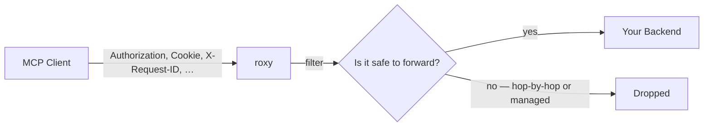

# Operations

## Header forwarding

When roxy runs in **HTTP transport** mode, every header the MCP client sends is automatically forwarded to your backend. This is how authorization, session IDs, and tracing headers reach your app without you configuring anything.



### Headers that are **dropped**

- Hop-by-hop headers (RFC 7230): `Connection`, `Keep-Alive`, `Proxy-Authenticate`, `Proxy-Authorization`, `TE`, `Trailer`, `Transfer-Encoding`, `Upgrade`.
- Roxy-managed headers: `Host`, `Content-Type`, `Content-Length`.
- The dangerous `Proxy` header (CVE-2016-5385 / "httpoxy").

### Headers that are **forwarded**

Everything else: `Authorization`, `Cookie`, `mcp-session-id`, `X-Forwarded-For`, any custom `X-*`, and so on.

### How it reaches your backend

**HTTP backends** receive them as real HTTP request headers. Multiple values of the same header (e.g. two `X-Forwarded-For`) are preserved.

**FastCGI backends** receive them as CGI parameters named `HTTP_*`, following RFC 3875. Example:

| Incoming header | FastCGI parameter |
|---|---|
| `Authorization: Bearer xyz` | `HTTP_AUTHORIZATION=Bearer xyz` |
| `X-Forwarded-For: 1.1.1.1` | `HTTP_X_FORWARDED_FOR=1.1.1.1` |

If a header has multiple values, roxy joins them with `, ` — this matches how nginx's `$http_*` variables expose them. CGI has no native multi-value support.

### Interaction with `--upstream-header`

`--upstream-header` sets roxy's **own** identity headers on HTTP upstreams (e.g. a bearer token that represents roxy itself). When a client-forwarded header has the same name, the **client value wins** — it's more specific.

`--upstream-header` currently does nothing for FastCGI backends. Use auto-forwarding instead.

### Under `--transport stdio`

There's no incoming HTTP request at all, so nothing is forwarded. Static `--upstream-header` still applies to HTTP upstreams.

---

## Logging and observability

roxy writes structured logs to standard error.

### Verbosity

Controlled with the standard `RUST_LOG` environment variable.

| `RUST_LOG` value | What you see |
|---|---|
| *(unset)* or `info` | Startup banner, transport + upstream info, one line per tool/resource/prompt call. |
| `debug` | Everything above, plus request/response bodies and header-forwarding details. |
| `trace` | Very verbose. Not recommended for production. |
| `roxy=debug,rmcp=info` | Per-module filtering. |

### Format

| `--log-format` | Output |
|---|---|
| `pretty` (default) | Human-friendly, colored if stderr is a terminal. |
| `json` | One JSON object per line. Works with Datadog, ELK, Loki, etc. |

### What normal startup looks like

```
INFO roxy: roxy starting
INFO roxy: transport: Stdio
INFO roxy: upstream: http://localhost:8000/mcp
INFO roxy: using HTTP executor → http://localhost:8000/mcp
INFO roxy: discovered 3 tools, 1 resource, 1 prompt
```

### What a tool call looks like

```
INFO roxy: call_tool: book_flight
```

With `RUST_LOG=debug` you also see the request URL, forwarded headers, and response payload.

---

## Error messages — what they mean

A quick guide to the most common problems.

| You see… | It means… | Try… |
|---|---|---|
| `error: the following required arguments were not provided: --upstream` | You forgot the `--upstream` flag. | Add `--upstream <your-backend-url>`. |
| `upstream error: connection refused` | Your backend isn't listening on the address you gave. | Check it's running. Check the host/port. |
| `upstream error: request timeout` | Your backend didn't answer within `--upstream-timeout` seconds. | Increase `--upstream-timeout` or investigate the backend. |
| `upstream returned HTTP 500` | Your backend returned an error status. | Look at your backend's logs. |
| `failed to parse upstream response` | Your backend returned something that isn't valid JSON, or missing required fields. | Log what you're returning and compare against this guide. |
| `failed to parse upstream discover response` | Your `discover` reply is malformed — roxy can't start. | Check every tool has `name` and `input_schema`; every resource has `uri` and `name`. |
| `failed to connect to FastCGI socket: No such file or directory` | The Unix socket path doesn't exist. | Check PHP-FPM is running and the socket path is correct. |
| `upstream response has no 'elicit', 'error', or 'content' field` | Your handler returned an empty or unknown-shape response. | Return one of `content`, `error`, or `elicit`. |
| `invalid header format: expected 'Name: Value'` | One of your `--upstream-header` entries is malformed. | Fix the syntax — colon plus space between name and value. |
| `invalid value 'TRUE' for '--upstream-insecure'` | Env variable only accepts lowercase `true` / `false`. | Use `true` or `false`. |
| TLS handshake error | The upstream's HTTPS certificate isn't trusted. | Install the CA, or (dev only) add `--upstream-insecure`. |

Errors that happen mid-request are also returned to the MCP client as standard JSON-RPC errors, so the AI can report them to the user.
